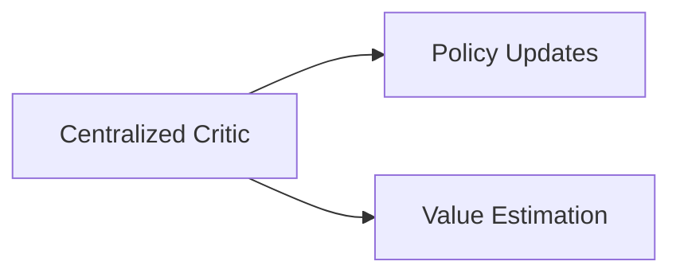

# critique this content


---
noteId: "98dc44602f6511f0afa623a169fabd0a"
tags: []

---

# 🎯 Key Terms in Multi-Agent Reinforcement Learning (MARL) and Applications

## 🤖 Core MARL Concepts

### 1. Agents and Environment

- 🤖 **Agent**: An autonomous entity that perceives its environment and takes actions
- 🌍 **Environment**: The shared space where agents interact and operate
- 📊 **State Space**: The set of all possible states in the environment
- 🎮 **Action Space**: The set of all possible actions an agent can take
- 👁️ **Observation Space**: What an agent can perceive from the environment


### 2. Learning Components

- 📋 **Policy**: Strategy that agents use to select actions
- 💰 **Value Function**: Estimates the expected return from a state
- 📈 **Q-Function**: Estimates the value of taking an action in a state
- 🏆 **Reward Function**: Provides feedback to agents about their actions
- 💾 **Experience Replay**: Stores and samples past experiences for learning


### 3. MARL-Specific Terms

- 🔄 **Centralized Training**: All agents' policies are trained together
- 🎯 **Decentralized Execution**: Agents act independently during deployment
- 👁️‍🗨️ **Partial Observability**: Agents can only see part of the environment
- 📡 **Communication Protocol**: Rules for agent-to-agent information exchange
- 🤝 **Coordination Mechanism**: Methods for agents to work together


## 🚀 Applications and Implementation Terms

### 1. Training Approaches

- 🎓 **Independent Learning**: Agents learn without considering others
- 👥 **Joint Action Learning**: Agents learn considering others' actions
- 🎭 **Centralized Critic**: Shared value function for multiple agents
- 📈 **Policy Gradient Methods**: Direct policy optimization techniques
- 🎬 **Actor-Critic Architecture**: Combines policy and value learning


### 2. Communication Terms

- 📨 **Message Passing**: Information exchange between agents
- 👀 **Attention Mechanism**: Focus on relevant information
- 🌐 **Graph Neural Networks**: Process structured agent relationships
- 📢 **Broadcast Protocol**: One-to-many communication
- 🤝 **Consensus Algorithm**: Agreement among agents


### 3. Environment Types

- 🤝 **Cooperative**: Agents work towards common goals
- ⚔️ **Competitive**: Agents have opposing objectives
- 🎭 **Mixed**: Combination of cooperative and competitive elements
- 🎲 **Stochastic**: Environment has random elements
- 📏 **Deterministic**: Environment follows fixed rules


## 🛠️ Practical Implementation Terms

### 1. Architecture Components

- 🧠 **Policy Network**: Neural network for action selection
- 💡 **Value Network**: Neural network for value estimation
- 💾 **Memory Buffer**: Storage for training data
- 🔄 **Synchronization Protocol**: Ensures consistent agent updates
- 🖥️ **Parameter Server**: Manages shared model parameters


### 2. Training Terms

- 📦 **Batch Size**: Number of experiences processed together
- 📊 **Learning Rate**: Step size for policy updates
- ⏳ **Discount Factor**: Importance of future rewards
- 🎲 **Exploration Rate**: Probability of taking random actions
- ✂️ **Gradient Clipping**: Prevents large policy updates


### 3. Evaluation Metrics

- 📈 **Convergence Rate**: Speed of learning
- 🤝 **Coordination Efficiency**: How well agents work together
- 📡 **Communication Overhead**: Cost of agent interactions
- 📊 **Scalability**: Performance with increasing agents
- 🛡️ **Robustness**: Performance under uncertainty


## 🎮 Application-Specific Terms

### 1. Robotics

- 📐 **Formation Control**: Maintaining specific spatial arrangements
- 🐝 **Swarm Intelligence**: Collective behavior of multiple robots
- 📋 **Task Allocation**: Distributing work among robots
- 🗺️ **Path Planning**: Finding optimal routes
- 🚫 **Obstacle Avoidance**: Preventing collisions


### 2. Game AI

- 🎮 **Team Strategy**: Coordinated group actions
- 🎯 **Opponent Modeling**: Understanding other players
- ⚖️ **Nash Equilibrium**: Stable strategy profile
- 🎲 **Minimax**: Decision-making in competitive scenarios
- 🤖 **AlphaZero**: Advanced game-playing algorithm


### 3. Resource Management

- ⚖️ **Load Balancing**: Distributing work evenly
- 📊 **Resource Allocation**: Assigning resources optimally
- ⏰ **Scheduling**: Timing of tasks and actions
- 📈 **Capacity Planning**: Managing system resources
- 🎯 **Optimization**: Finding best solutions


## 🧠 Advanced Concepts

### 1. Learning Methods

- 🔄 **Transfer Learning**: Applying knowledge across domains
- 📚 **Meta-Learning**: Learning to learn
- 📑 **Hierarchical Learning**: Multi-level decision making
- 📖 **Curriculum Learning**: Progressive difficulty increase
- 👨‍🏫 **Imitation Learning**: Learning from expert demonstrations


### 2. Optimization Techniques

- 📉 **Gradient Descent**: Basic optimization method
- 📈 **Policy Optimization**: Improving agent strategies
- 🔄 **Value Iteration**: Computing optimal value functions
- 🎲 **Monte Carlo Methods**: Sampling-based learning
- ⏱️ **Temporal Difference Learning**: Online learning approach


### 3. System Design

- 🔄 **Distributed Training**: Parallel learning across machines
- 🔒 **Federated Learning**: Privacy-preserving training
- 🧩 **Model Parallelism**: Splitting models across devices
- 📊 **Data Parallelism**: Processing different data batches
- ⚡ **Asynchronous Updates**: Non-blocking training


## 🔮 Future Directions

### 1. Emerging Concepts

- 📚 **Multi-Task Learning**: Learning multiple objectives
- ⏳ **Continual Learning**: Learning over time
- 🎯 **Self-Supervised Learning**: Learning without explicit labels
- ⚔️ **Adversarial Training**: Learning through competition
- 👥 **Reinforcement Learning from Human Feedback**: Learning from human preferences


### 2. Research Areas

- 📊 **Sample Efficiency**: Learning with less data
- 🔄 **Generalization**: Applying knowledge to new situations
- 🔍 **Interpretability**: Understanding agent decisions
- 🛡️ **Safety**: Ensuring reliable behavior
- 🤝 **Ethics**: Responsible AI development

---
*This guide provides a comprehensive overview of key terms in MARL and their applications. Understanding these concepts is crucial for implementing effective multi-agent systems.*

## 🎨 Color Legend

- 🤖 **Agent-related terms**: Blue
- 🌍 **Environment-related terms**: Green
- 📊 **Learning and metrics**: Orange
- 🛠️ **Implementation terms**: Purple
- 🎮 **Application terms**: Red
- 🧠 **Advanced concepts**: Teal
- 🔮 **Future directions**: Magenta

Here's a constructive critique of your MARL terminology guide:

### 🌟 **Strengths**

1. **Engaging Presentation**
    - Emojis and headers create visual interest
    - Clear hierarchical structure with well-defined sections
    - Effective use of categorization (Core/Applications/Implementation)
2. **Comprehensive Coverage**
    - Includes fundamental concepts (policies, Q-functions)
    - Addresses advanced topics (meta-learning, federated learning)
    - Connects theory to real-world applications (robotics, game AI)
3. **Actionable Organization**
    - Logical grouping of related terms
    - Clear progression from basics to advanced concepts
    - Helpful division between theoretical and practical elements

### 🚧 **Areas for Improvement**

#### **1. Consistency \& Clarity**

- 🔄 Some term categorizations overlap (e.g., "Policy Gradient Methods" appears in both Learning Components and Training Approaches)
- 🔍 Several terms need clearer MARL-specific context (e.g., "Minimax" is generic game theory)
- 🎨 Color legend references aren't implemented in actual content


#### **2. Depth \& Context**

- 📚 Missing critical MARL paradigms:
    - CTDE (Centralized Training with Decentralized Execution)
    - Non-stationarity challenges
    - Credit assignment problem
- 🎯 Some application terms lack MARL-specificity (e.g., "Load Balancing" is too generic)
- 🔗 Could benefit from cross-linking related concepts (e.g., connect Nash Equilibrium to Game AI)


#### **3. Structural Suggestions**

```markdown
Proposed Reorganization:
## 🤖 Fundamental Concepts
  ### Agent Properties
  ### Environment Dynamics
  ### Learning Foundations

## 🌀 MARL-Specific Challenges
  • Partial observability impacts  
  • Non-stationary environments  
  • Credit assignment mechanisms
```


#### **4. Visual Enhancements**

- Replace some emojis with functional icons:
🔄 → for update mechanisms
⚖️ → for equilibrium concepts
- Add simple diagrams for complex relationships:



- Use actual color coding if technically feasible


### 🛠️ **Quick Fix Recommendations**

1. Add brief context bullets for key terms:
*"AlphaZero: MARL adaptation uses tree search with neural networks for strategy optimization"*
2. Implement true color coding or remove color legend
3. Include acronym expansions:
*"CTDE (Centralized Training Decentralized Execution)"*
4. Add priority markers for core concepts:
"⭐ Essential for implementation"
"📚 Theoretical foundation"

### 📈 **Impact Potential**

This framework could become an excellent MARL quick-reference guide with:

1. Brief definitions (10-15 words per term)
2. Real-world examples column
3. Cross-referencing system
4. Difficulty level indicators

Would you like specific suggestions for implementing any of these improvements?

