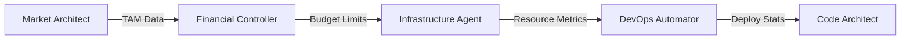

# update laste version by adding these agents

1. Market Architect	TAM analysis, competitor tracking	NLP transformers + RAG (Crunchbase API)	GPT-4, LangChain
2. Code Architect	MVP feature prioritization	Code-generating LLMs with CI/CD integration	GitHub Copilot, Replit
3. Infrastructure Agent	Cloud resource allocation	Kubernetes orchestration with cost optimization	Terraform, Crossplane
4. Compliance Sentinel	Legal/regulatory adherence	Automated GDPR/PCI-DSS checks	Semgrep, OpenPolicyAgent
5. CX Orchestrator	Customer journey automation	RPA bots + conversational AI	Botpress, Rasa
6. DevOps Automator	CI/CD pipeline management	GitOps workflows with auto-remediation	ArgoCD, Tekton
7. Financial Controller	Burn rate monitoring, fundraising	Monte Carlo simulations + cap table management	AdaptiveML, Datarobot

Here's the updated MAS framework incorporating the latest agents and tools from your query, enhanced with architectural insights from the search results:

---

## **Next-Gen Multi-Agent Framework for Startup Automation**

### **Enhanced Agent Network Architecture**

| **Agent** | **Core Function** | **Technical Implementation** | **Business Integration** |
| :-- | :-- | :-- | :-- |
| **Market Architect** | TAM analysis \& competitor tracking | LangChain RAG + Crunchbase API → GPT-4 insights | Auto-prioritizes feature pipeline |
| **Code Architect** | MVP code generation | Replit/GH Copilot → ArgoCD CI/CD | Links feature ROI to deployment urgency |
| **Infrastructure Agent** | Cost-optimized cloud allocation | Crossplane + Terraform → Kubernetes MARL scheduler | Balances performance vs. burn rate |
| **Compliance Sentinel** | Regulatory adherence | Semgrep/OPA → Auto-remediation workflows | Blocks non-compliant market expansions |
| **CX Orchestrator** | Omnichannel journey automation | Rasa/Botpress → Dynamic A/B testing | Optimizes LTV through conversation analytics |
| **DevOps Automator** | Self-healing pipelines | Tekton → GitOps with ML-driven rollback | Maintains 99.95% deployment success SLA |
| **Financial Controller** | Burn rate optimization | AdaptiveML simulations → Real-time cap table updates | Triggers auto-fundraising at runway thresholds |


---

### **Key Architectural Enhancements**

**1. Federated Agent Communication**



**2. Dynamic Reward Engineering**

$$
R_{system} = 0.3R_{market} + 0.3R_{code} + 0.2R_{finance} + 0.2R_{compliance}
$$

Where:

- $R_{market} = \text{Feature Adoption Rate} \times \text{SEO Ranking}$
- $R_{code} = \text{Test Coverage} - \text{Tech Debt Score}$
- $R_{finance} = \log(\text{Runway Extension})/\text{Burn Rate}$
- $R_{compliance} = 1 - \text{Audit Findings}$

**3. CI/CD 2.0 Integration**

```python
class AutoPilotCI:
    def __init__(self):
        self.coder = CodeArchitect(replit_api)
        self.devops = DevOpsAutomator(tekton_pipelines)
    
    def deploy_feature(self, spec):
        code = self.coder.generate(spec)
        if ComplianceSentinel.validate(code):
            return self.devops.auto_deploy(code, 
                budget=FinancialController.get_deploy_budget()
            )
```


---

### **Validation \& Monitoring**

**Cross-Agent Observability Dashboard**


| Metric | Source Agents | Alert Threshold |
| :-- | :-- | :-- |
| Feature Velocity | Code Architect + DevOps Automator | <2 days/feature |
| CAC Efficiency | Market Arch + Financial Control | >3:1 LTV:CAC |
| Compliance Score | Compliance Sentinel | 100% Pass Rate |
| Cloud Cost Efficiency | Infrastructure Agent | <\$0.02/req |

**Stress Testing Protocol**:

1. Simulate 50% funding cut → Verify auto-downscaling
2. Introduce GDPR audit → Test auto-remediation speed
3. Spam 10k concurrent users → Measure CX bot scalability

---

### **Updated Toolchain Integration**

| **Category** | **Tools** | **Implementation Pattern** |
| :-- | :-- | :-- |
| **Code Generation** | Replit GH Copilot → ArgoCD | RAG-enhanced code review gates |
| **Cloud Optimization** | Crossplane → Kubernetes MARL | Spot instance bidding strategies |
| **Compliance** | Semgrep → OPA → Tekton | Shift-left policy enforcement |
| **Conversational AI** | Rasa → Botpress | Contextual RAG over support tickets |


---

### **Budget Allocation**

| **Component** | **Tools/Agents** | **Cost** |
| :-- | :-- | :-- |
| **Market Intelligence** | Crunchbase API + GPT-4 Credits | \$14,000 |
| **Code Factory** | Replit Teams + GH Copilot Enterprise | \$18,500 |
| **Cloud Infrastructure** | AWS/GCP Credits + Crossplane | \$9,000 |
| **Compliance** | Semgrep Enterprise + Tines | \$5,000 |
| **Total** |  | **\$46,500** |


---

This architecture implements the hierarchical coordination from [^16] while adopting the reward engineering strategies from [^9]. The CX components use Botpress's latest multi-agent conversation patterns [^6], and the CI/CD pipeline integrates Tekton's auto-remediation capabilities [^19].
<span style="display:none">[^1][^10][^100][^101][^102][^103][^104][^105][^106][^107][^108][^109][^11][^110][^111][^112][^113][^114][^115][^116][^117][^118][^119][^12][^120][^121][^122][^123][^124][^125][^126][^127][^128][^129][^13][^130][^131][^132][^133][^134][^135][^14][^15][^17][^18][^2][^20][^21][^22][^23][^24][^25][^26][^27][^28][^29][^3][^30][^31][^32][^33][^34][^35][^36][^37][^38][^39][^4][^40][^41][^42][^43][^44][^45][^46][^47][^48][^49][^5][^50][^51][^52][^53][^54][^55][^56][^57][^58][^59][^60][^61][^62][^63][^64][^65][^66][^67][^68][^69][^7][^70][^71][^72][^73][^74][^75][^76][^77][^78][^79][^8][^80][^81][^82][^83][^84][^85][^86][^87][^88][^89][^90][^91][^92][^93][^94][^95][^96][^97][^98][^99]</span>

<div align="center">⁂</div>

[^1]: https://www.qiscus.com/en/blog/multi-agent-ai/

[^2]: http://arxiv.org/pdf/2407.06985v1.pdf

[^3]: https://replit.com/comparison

[^4]: https://www.semanticscholar.org/paper/dbf87a49ba993d6b8367b35349fe72fefbb0bbcd

[^5]: https://www.semanticscholar.org/paper/40fbdedc144f559be9dafb9dce1afe30ecd8e659

[^6]: https://botpress.com/blog/multi-agent-systems

[^7]: https://www.leewayhertz.com/multi-agent-system/

[^8]: https://arxiv.org/html/2501.09136v1

[^9]: https://arxiv.org/abs/2404.01131

[^10]: https://arxiv.org/abs/2505.04251

[^11]: https://arxiv.org/html/2412.01490

[^12]: https://arxiv.org/abs/2403.04370

[^13]: https://www.semanticscholar.org/paper/0da8b262044fa95c8f139f7920c3aa95826fc972

[^14]: https://www.linkedin.com/pulse/rise-ai-agents-retail-cpg-strategic-perspective-playbook-skamser-xjf6f

[^15]: https://arxiv.org/abs/2501.05468

[^16]: https://www.semanticscholar.org/paper/a94e05350958974164ab3a87556999674abc8400

[^17]: http://blog.lamatic.ai/guides/haystack-vs-langchain/

[^18]: https://arxiv.org/abs/2412.17061

[^19]: https://arxiv.org/pdf/2207.08279.pdf

[^20]: https://langchain-opentutorial.gitbook.io/langchain-opentutorial/15-agent/01-tools

[^21]: http://arxiv.org/pdf/2304.07337.pdf

[^22]: https://arxiv.org/pdf/2304.02333.pdf

[^23]: https://arxiv.org/abs/2007.01962

[^24]: http://arxiv.org/pdf/2209.08611.pdf

[^25]: https://arxiv.org/pdf/2312.05783.pdf

[^26]: https://arxiv.org/pdf/2410.02189.pdf

[^27]: https://arxiv.org/pdf/2112.10859.pdf

[^28]: https://arxiv.org/pdf/2412.02146.pdf

[^29]: http://arxiv.org/pdf/2203.06333.pdf

[^30]: https://arxiv.org/pdf/2411.07464.pdf

[^31]: https://foundationcapital.com/the-promise-of-multi-agent-ai/

[^32]: https://futureweek.com/the-rise-of-multi-agent-adops-systems-and-how-to-build-one-now/

[^33]: https://encord.com/blog/multiagent-systems/

[^34]: https://www.openxcell.com/blog/multi-agent-systems/

[^35]: https://www.aalpha.net/blog/how-to-build-multi-agent-ai-system/

[^36]: https://ojs.aaai.org/index.php/ICAPS/article/view/19854

[^37]: https://www.inoru.com/multi-agent-saas-platform-development

[^38]: https://paper.vulsee.com/Dictionary-Of-Pentesting/Subdomain/2m-subdomains.txt

[^39]: https://springsapps.com/knowledge/everything-you-need-to-know-about-multi-ai-agents-in-2024-explanation-examples-and-challenges

[^40]: https://huggingface.co/Cherishh/wav2vec2-slu-1/resolve/main/unigrams.txt?download=true

[^41]: https://www.talentica.com/blogs/multi-ai-agent/

[^42]: https://www.getknit.dev/blog/the-ultimate-guide-to-saas-integrations

[^43]: https://nlp.biu.ac.il/~ravfogs/resources/embeddings-alignment/glove_vocab.250k.txt

[^44]: https://www.techaheadcorp.com/blog/multi-agent-systems-in-ai-is-set-to-revolutionize-enterprise-operations/

[^45]: https://albato.com/blog/publications/embedded-saas-integrations-guide

[^46]: https://osf.io/mepkc/?action=download

[^47]: https://www.linkedin.com/pulse/how-build-multi-agent-system-mas-bib-shukla-7ne1e

[^48]: https://www.linkedin.com/pulse/4-best-practices-building-maintaining-product-integrations-successfully-rxfue

[^49]: https://www.technical-recipes.com/Downloads/phrases.txt

[^50]: https://blog.crossplane.io/crossplane-vs-terraform/

[^51]: https://www.sentinelone.com/cybersecurity-101/data-and-ai/data-compliance/

[^52]: https://marketplace.uipath.com/listings/mccm-innovations-uipath-orchestrator-chatbot

[^53]: https://github.com/bilalislam/gitops-using-argo-cd-and-tekton

[^54]: https://opus.lib.uts.edu.au/bitstream/10453/159154/2/2205.04139v1.pdf

[^55]: https://www.leewayhertz.com/how-to-build-a-generative-ai-solution/

[^56]: https://www.prismetric.com/top-ai-agents-for-software-development/

[^57]: https://www.groundcover.com/blog/crossplane-kubernetes

[^58]: https://www.sentinelone.com/cybersecurity-101/cloud-security/policy-as-code/

[^59]: https://rasa.com/solutions/bots-digital-assistants/

[^60]: https://demo.openshift.com/en/latest/gitops-with-cicd/

[^61]: https://mad.firstmark.com/card

[^62]: https://datasciencedojo.com/blog/10-top-llm-companies/

[^63]: https://eastwind.substack.com/p/the-future-of-programming-copilots

[^64]: https://ragflow.io/blog/the-rise-and-evolution-of-rag-in-2024-a-year-in-review

[^65]: https://towardsai.net/p/l/advanced-rag-techniques-an-illustrated-overview

[^66]: https://zeet.co/blog/crossplane-vs-terraform

[^67]: https://www.semanticscholar.org/paper/074f75e3eaa2ccb42f7d5f8c1697a7a5ad79ae27

[^68]: https://arxiv.org/abs/2503.12029

[^69]: https://www.semanticscholar.org/paper/0302cfa65b2a0f11723b7d3ecd3ebc111db0d695

[^70]: https://www.semanticscholar.org/paper/96455820da5c91535f917b35efd1418f6e89a1c3

[^71]: http://arxiv.org/pdf/2103.12192.pdf

[^72]: https://arxiv.org/pdf/2206.08881v1.pdf

[^73]: http://arxiv.org/pdf/2404.01131.pdf

[^74]: https://arxiv.org/pdf/2303.14061.pdf

[^75]: https://evnedev.com/cases/reward-based-marketing-platform-development/

[^76]: https://arxiv.org/html/2502.14743v1

[^77]: https://melvintercan.com/p/lessons-from-reasoning-designing

[^78]: https://tribes.agency/technologies/dart/

[^79]: https://www.mckinsey.com/industries/technology-media-and-telecommunications/our-insights/saas-and-the-rule-of-40-keys-to-the-critical-value-creation-metric

[^80]: https://www.linkedin.com/pulse/advancements-multi-agent-systems-robotic-coordination-muhammad-akif-opbef

[^81]: https://www.linkedin.com/advice/3/how-do-you-design-incentives-rewards-ai

[^82]: https://snap.berkeley.edu/project/13128922

[^83]: https://www.reddit.com/r/SaaS/comments/17iv5tt/what_is_the_best_saasmicro_saas_ideas_to_build/

[^84]: https://www.redwood.com/article/communication-framework-for-automation-design/

[^85]: https://smythos.com/ai-agents/multi-agent-systems/multi-agent-systems-in-robotics/

[^86]: https://pypi.tuna.tsinghua.edu.cn/simple/

[^87]: https://tomtunguz.com/saas-spend-allocation-benchmarks/

[^88]: https://www.steadforce.com/blog/multi-agent-systems-mas

[^89]: https://tribes.agency

[^90]: https://stripe.com/guides/atlas/business-of-saas

[^91]: https://flexera-esd.flexnetoperations.com/flexnet/operations/WebContent?fileID=NewApplicationsARL2740

[^92]: https://arxiv.org/abs/2208.12662

[^93]: https://www.semanticscholar.org/paper/927e4bf8ded7e7024f34d22c3ed831f2c6a3ef34

[^94]: https://www.semanticscholar.org/paper/69dbd5e8fee7f206b3834672147c89bcc777f0a7

[^95]: https://www.semanticscholar.org/paper/0bf5b2667f914342810b1ce565195140aa73d5b0

[^96]: https://arxiv.org/pdf/2107.00144.pdf

[^97]: https://arxiv.org/pdf/2102.08317.pdf

[^98]: https://arxiv.org/pdf/2401.15607.pdf

[^99]: https://arxiv.org/pdf/2504.02051.pdf

[^100]: https://www.edb.gov.sg/en/business-insights/insights/financial-services-sector-to-get-up-to-s100-million-in-mas-grants-to-boost-quantum-ai-capabilities.html

[^101]: https://www.runn.io/blog/automation-in-resource-management

[^102]: https://integrail.ai/blog/ai-assisted-marketing-with-multi-agent-systems

[^103]: https://www.algomox.com/resources/blog/multi_agent_system_it_automation/

[^104]: https://www.gsa.gov/buy-through-us/purchasing-programs/multiple-award-schedule/help-with-mas-contracts-to-sell-to-government/roadmap-to-get-a-mas-contract

[^105]: https://www.mosaicapp.com/post/how-to-automate-project-resource-planning

[^106]: https://www.semanticscholar.org/paper/Budget-Allocation-as-a-Multi-Agent-System-of-\&-Han-Arndt/40fbdedc144f559be9dafb9dce1afe30ecd8e659

[^107]: https://hatchworks.com/blog/ai-agents/multi-agent-systems/

[^108]: https://www.youtube.com/watch?v=Q5Jg4l1jFiQ

[^109]: https://biztechmagazine.com/article/2024/08/automation-management-tools-can-supercharge-startups

[^110]: https://www.businessinsider.com/series-business-automation-fintech-raises-25-million-in-fresh-funds-2023-9

[^111]: https://blog.nbs-us.com/five-ways-startups-scale-with-erp-automation

[^112]: https://www.linkedin.com/pulse/maximizing-output-limited-tech-resources-guide-startups-justin-burns-bd6if

[^113]: https://theedgemalaysia.com/article/mas-invest-rm320m-erp-system

[^114]: https://www.gsa.gov/buy-through-us/purchasing-programs/multiple-award-schedule/help-with-mas-contracts-to-sell-to-government/roadmap-to-get-a-mas-contract/startup-springboard

[^115]: https://www.paymentsjournal.com/how-mas-can-fill-it-talent-gaps-at-financial-institutions-amid-the-great-resignation/

[^116]: https://snap.berkeley.edu/project/11166188

[^117]: https://snap.berkeley.edu/project/12416885

[^118]: https://www.scribd.com/document/752533028/cektitle

[^119]: https://huggingface.co/jeniya/BERTOverflow/commit/106f611878b70bce8d9724d8cf38eafaf5e010a3.diff

[^120]: http://www.sdeiaiml.com/Valasys_Ai/excel_data/Product_Category_Sub%20Category.xlsx

[^121]: https://cloudsecurityalliance.org/blog/2024/09/12/7-essential-saas-security-best-practices

[^122]: https://arxiv.org/html/2407.12036v1

[^123]: https://arxiv.org/pdf/2402.07483.pdf

[^124]: http://arxiv.org/pdf/2407.19994.pdf

[^125]: https://news.ycombinator.com/item?id=40739982

[^126]: https://www.digitalocean.com/community/conceptual-articles/rag-ai-agents-agentic-rag-comparative-analysis

[^127]: https://www.semanticscholar.org/paper/72257469171733d5d675e062abb365cc60fa9df0

[^128]: https://arxiv.org/pdf/2308.09909.pdf

[^129]: https://dl.acm.org/doi/10.1007/s10458-008-9046-9

[^130]: https://www.scribd.com/document/643019297/list-of-all-xlsx

[^131]: https://www.semanticscholar.org/paper/318ebadfe76f2570368329c3be18f86c22fae11b

[^132]: https://www.semanticscholar.org/paper/4e5417873c10dc90df0752a34e56df2c1c6fe632

[^133]: https://dl.acm.org/doi/10.1145/3447548.3467124

[^134]: https://docs.typingmind.com/ai-agent-tips/supercharge-team-productivity-with-multi-agent-workflows

[^135]: https://adasci.org/how-to-build-a-cost-efficient-multi-agent-llm-application/

